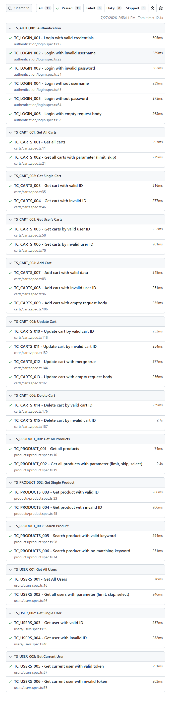
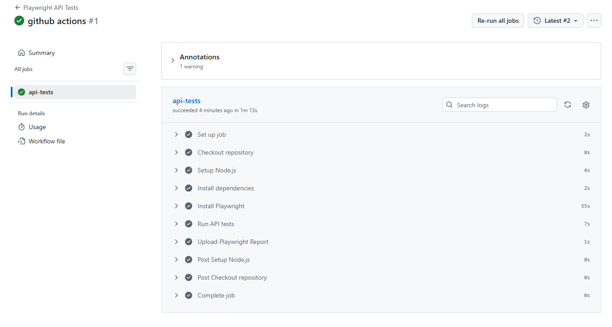

# 🚀 Playwright API Automation — DummyJSON


API automation testing project using **Playwright + TypeScript** for testing REST APIs on DummyJSON.

This project was created to practice and demonstrate:

- API Automation Testing
- REST API Testing
- API Validation
- Test Design
- Clean Test Structure

---

## 🌐 Application Under Test (AUT)

🔗 **[DummyJSON](https://dummyjson.com/docs/)**

---

## 📌 Project Overview

This project contains **33 automated API test cases** built with Playwright and TypeScript to validate core REST API functionalities provided by DummyJSON.

- 🔐 Authentication
- 👤 Users
- 📦 Products
- 🛒 Cart Management
- 🔄 CRUD Operations
- ✅ API Response Validation

---

## 🧪 Test Coverage

| Feature | Test Cases |
| -------- | ---------: |
| Authentication | 6 |
| Users | 6 |
| Products | 6 |
| Cart | 15 |
| **Total** | **33** |

---

## 🏗️ Framework Features

- ✅ Modular Test Structure
- ✅ Reusable API Classes
- ✅ Centralized Test Data
- ✅ Environment Variables (.env)
- ✅ API Response Validation
- ✅ GitHub Actions (CI/CD)
- ✅ Playwright HTML Report

---

## ⚙️ Tech Stack

- 🎭 Playwright
- 🔵 TypeScript
- 🟢 Node.js
- 🌐 REST API
- 📊 Playwright HTML Report

---

## 🚀 Installation

Clone repository:

```bash
git clone https://github.com/tsaniawarda2/dummyjson-api-playwright.git
```

Install dependencies:

```bash
npm install
```

Install Playwright:

```bash
npx playwright install
```

Run all tests:

```bash
npx playwright test
```

Run Authentication tests:

```bash
npx playwright test tests/authentication
```

Run Users tests:

```bash
npx playwright test tests/users
```

Run Products tests:

```bash
npx playwright test tests/products
```

Run Cart tests:

```bash
npx playwright test tests/carts
```

Open HTML Report:

```bash
npx playwright show-report
```
---
## 📷 HTML Report



---
## ⚙️ Continuous Integration (CI)

Every push and pull request automatically triggers a GitHub Actions workflow that:

- Checks out the repository
- Installs project dependencies
- Installs Playwright
- Runs all API automation tests
- Generates the Playwright HTML Report
- Uploads the report as a workflow artifact

### Workflow Execution



✨ Built for learning REST API testing, automation best practices, and scalable Playwright API test development.
